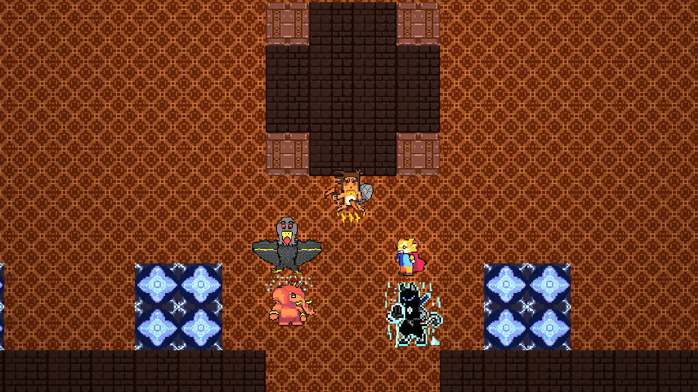
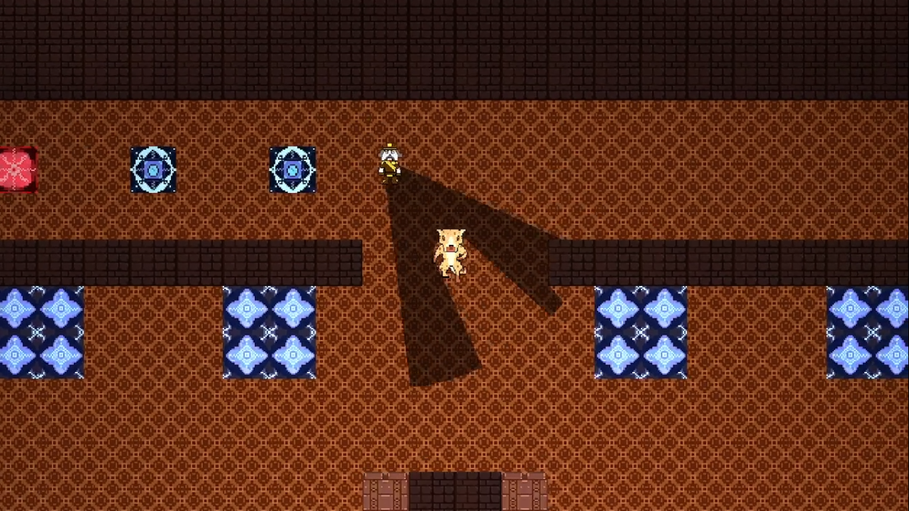
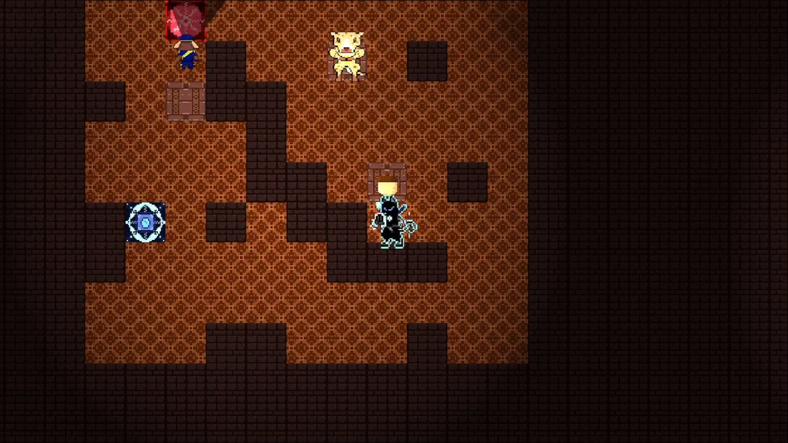

# Sync-O-Theft Game Marketing Website

## 🎮 About

Sync-O-Theft is a top-down 2D stealth game with a non-linear timeline perspective. This repository contains the official marketing website built with Next.js, React, and TypeScript to showcase the game's features, story, and provide downloads.

**[🔗 Live Demo](https://sync-o-theft-game.vercel.app)** 

## ✨ Features

- **Responsive Design**: Fully responsive website that looks great on all devices
- **Interactive Elements**: Dynamic components including video trailer, screenshot gallery, and how-to-play guide
- **Modern UI**: Sleek, game-themed interface built with Tailwind CSS and shadcn/ui components
- **Performance Optimized**: Fast loading times and optimized assets
- **SEO Friendly**: Proper metadata and semantic HTML structure

## 📸 Screenshots

  
  

## 🛠️ Technologies

- **Frontend Framework**: [Next.js 14](https://nextjs.org/)
- **UI Library**: [React 18](https://reactjs.org/)
- **Type Safety**: [TypeScript](https://www.typescriptlang.org/)
- **Styling**: [Tailwind CSS](https://tailwindcss.com/)
- **Component Library**: [shadcn/ui](https://ui.shadcn.com/)
- **Icons**: [Lucide React](https://lucide.dev/)
- **Deployment**: [Vercel](https://vercel.com/)

## 🚀 Getting Started

### Prerequisites

- Node.js 18.x or higher
- npm or yarn

### Installation

1. Clone the repository:
   \`\`\`bash
   git clone https://github.com/yourusername/sync-o-theft-website.git
   cd sync-o-theft-website
   \`\`\`

2. Install dependencies:
   \`\`\`bash
   npm install
   # or
   yarn install
   \`\`\`

3. Run the development server:
   \`\`\`bash
   npm run dev
   # or
   yarn dev
   \`\`\`

4. Open [http://localhost:3000](http://localhost:3000) in your browser to see the result.

## 🎮 Game Features

- **Immersive World**: Explore vast, detailed environments filled with secrets
- **Epic Battles**: Face challenging enemies with a deep combat system
- **Compelling Story**: Experience a rich narrative with memorable characters
- **Stunning Visuals**: Witness breathtaking graphics and visual effects
- **Dynamic Soundtrack**: Immerse yourself in an adaptive musical score
- **Multiplayer Mode**: Team up with friends in various cooperative modes

## 📖 Game Story

Once upon a time there were some squirrels that mastered bird's food heist, cracked 3 squirrel-proof wild-bird feeders and lived happily ever after. Until... some youtuber, who became a bird watcher for illogical reasons, decided to make their life much worse by building a giant maze to test the squirrels' mental and physical limits.

Two of those squirrels were Slappy and her friend Skippy, who went to the grand squirrel for wisdom. He advised them to forget the life-supply of nuts and instead draw the perfect plan to rob the local bank in their area.

Follow their journey as they recruit new team members and become the most notorious animal thieves in the kingdom!

## 🧩 How to Play

In Sync-O-Theft, you control a team of skilled animal thieves, each with unique abilities:

1. **Choose Your Team**: Select from characters like Squirrel, The Prince, Steve, Ghost, Ninja, and more
2. **Plan Your Heist**: Strategically plan each character's movements and actions
3. **Execute with Precision**: Navigate through challenging environments and outsmart guards
4. **Synchronize Timeline**: Coordinate your team's actions across different time periods
5. **Collect the Loot**: Steal valuable nuts and escape without getting caught

## 🤝 Contributing

Contributions are welcome! If you'd like to contribute, please follow these steps:

1. Fork the repository
2. Create a new branch (`git checkout -b feature/amazing-feature`)
3. Make your changes
4. Commit your changes (`git commit -m 'Add some amazing feature'`)
5. Push to the branch (`git push origin feature/amazing-feature`)
6. Open a Pull Request

## 📄 License

This project is licensed under the MIT License - see the [LICENSE](LICENSE) file for details.

## 👏 Acknowledgments

- Game developed by Five Little Thieves
- Website design inspired by modern game marketing sites
- Special thanks to all the beta testers and contributors

---

  
© 2025 Sync-O-Theft. All rights reserved.

 

